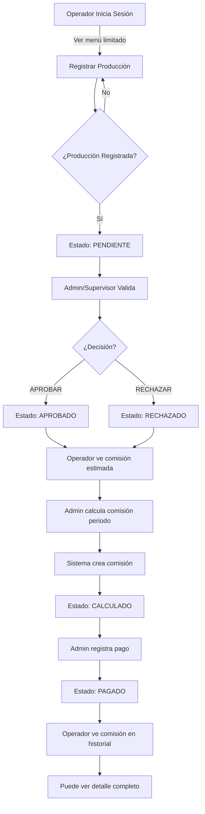
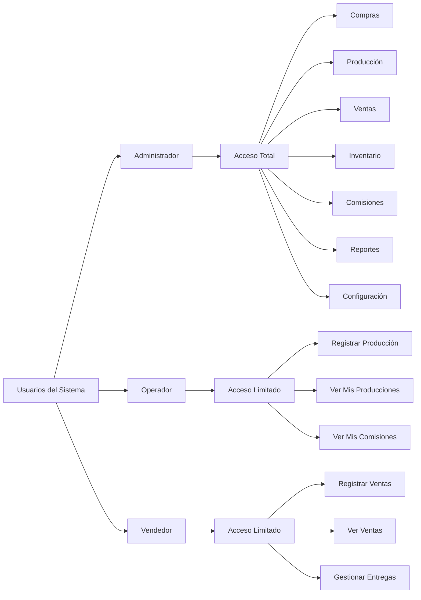
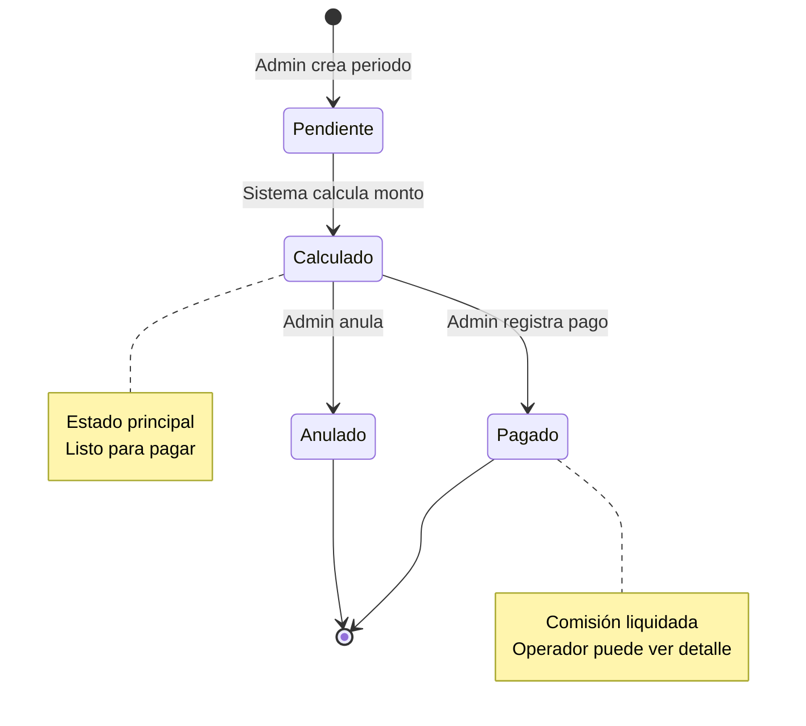
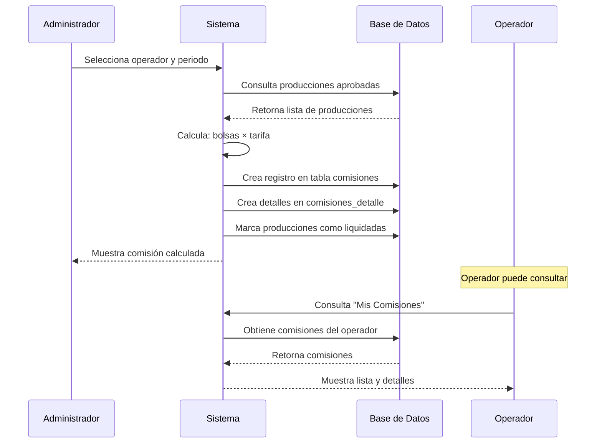
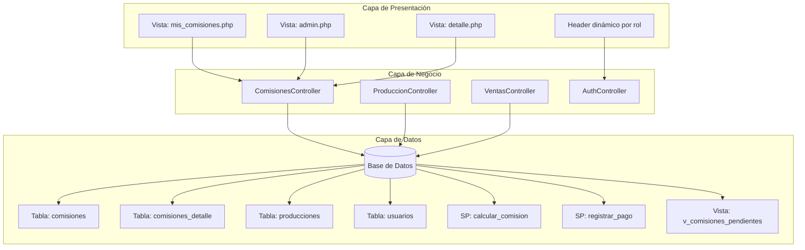
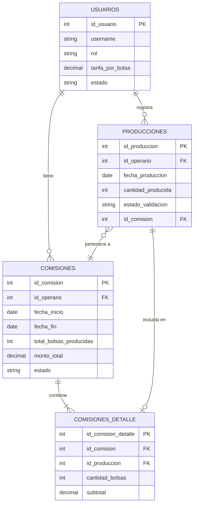
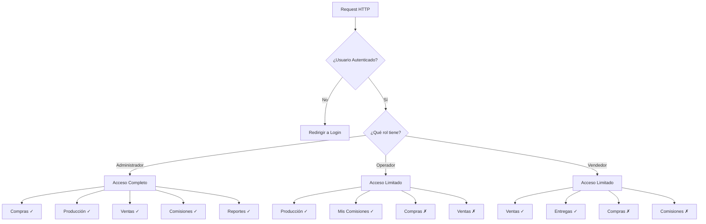

<!-- DIAGRAMA DE FLUJO DEL SISTEMA DE COMISIONES -->
<!-- Abrir este archivo en un visualizador Mermaid o en VS Code con extensión Mermaid -->

# Diagrama de Flujo - Sistema de Comisiones

## Flujo Principal

## Roles y Permisos

## Estados de una Comisión

## Flujo de Cálculo de Comisión

## Arquitectura del Sistema

## Relaciones de Tablas (ERD Simplificado)

## Flujo de Permisos por Controlador

---

## Leyenda

- **→** : Flujo normal
- **✓** : Permitido
- **✗** : Denegado
- **PK** : Primary Key
- **FK** : Foreign Key
- **SP** : Stored Procedure

---

## Notas de Implementación

1. Todos los diagramas están en formato Mermaid
2. Pueden visualizarse en VS Code con la extensión "Markdown Preview Mermaid Support"
3. O en cualquier visualizador online de Mermaid (mermaid.live)
4. Los diagramas reflejan la arquitectura implementada

---

**Fecha:** 14 de Enero, 2026  
**Versión:** 1.0
